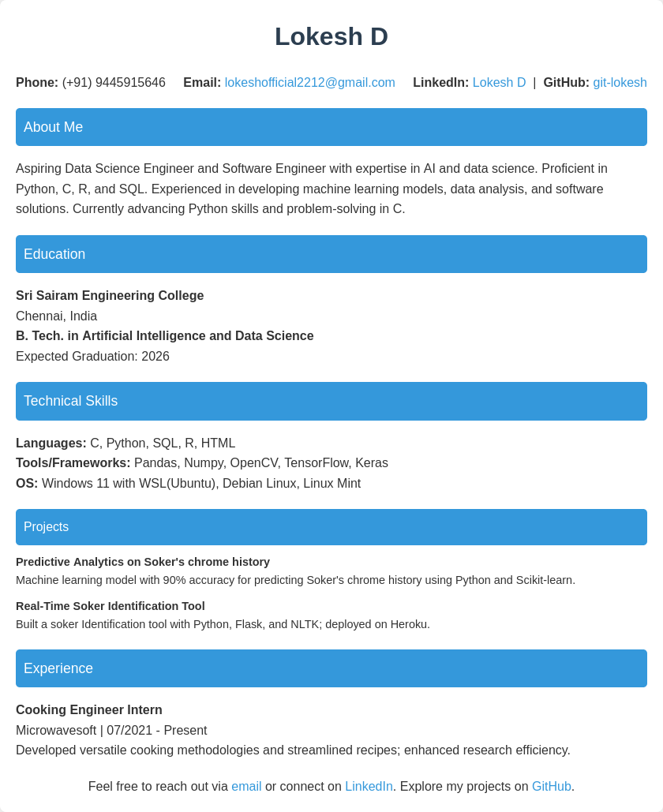
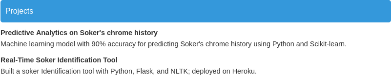

# Lokesh D - Resume

This is a simple HTML/CSS resume template for Lokesh D, a Data Science Engineer and Software Engineer with expertise in AI and data science. The resume is designed to be clean, modern, and easy to read, with a focus on showcasing technical skills and projects.

## Table of Contents
- [Features](#features)
- [Setup](#setup)
- [Usage](#usage)
- [Screenshots](#screenshots)
- [Contributing](#contributing)
- [License](#license)

## Features
- **Responsive Design**: The resume layout adjusts based on the screen size.
- **Simple and Clean Layout**: The design is focused on readability and ease of navigation.
- **Easy to Customize**: Modify the content directly in the HTML file.
- **Modern Aesthetic**: Uses a minimalistic design with a professional color scheme.

## Screenshots

### Full View of the Resume

### Contact Information Section

### Projects Section

## License

This project is open-source and available under the MIT License. See the [LICENSE](LICENSE) file for more information.
